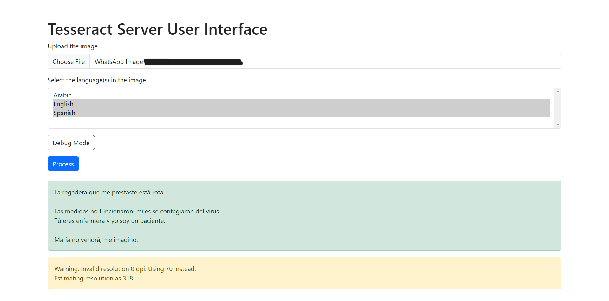

# tesseract-ocr-server-web-ui



## Pre-Installation

### With Docker

1. You should have [Docker](https://docs.docker.com/engine/install/) installed.
2. You should have [tesseract-server](https://github.com/hertzg/tesseract-server) up and running.

### Without Docker

1. You should have [php](https://www.php.net/) (tested with php 7.3, php 7.4, php 8.0 & php 8.1).
2. You should have [tesseract-server](https://github.com/hertzg/tesseract-server) up and running.

## Installation

### Docker Method

1. Clone this repository:

    ```bash
    git clone https://github.com/m-primo/tesseract-server-ui.git
    ```

2. Build the Docker image:

    ```bash
    docker build -t tesseract-ocr-server-web-ui .
    ```

3. Run the Docker container (edit whatever you want):

    ```bash
    docker run --name tesseract-ocr-server-web-ui -d --restart unless-stopped -v /path/to/config:/app/config -p 8080:8080 tesseract-ocr-server-web-ui
    ```

4. Create a Docker network to connect both containers to each other:

    ```bash
    docker network create tesseract-network
    ```

5. Attach the network to the `tesseract-server` container (replace `<tesseract-server-container-id>` with the `tesseract-server` container id):

    ```bash
    docker network connect tesseract-network <tesseract-server-container-id>
    ```

6. Attach the network to the `tesseract-ocr-server-web-ui` container:

    ```bash
    docker network connect tesseract-network tesseract-ocr-server-web-ui
    ```

7. Get the IP of the `tesseract-server` container (replace `<tesseract-server-container-id>` with the `tesseract-server` container id):

    ```bash
    docker inspect <tesseract-server-container-id>
    ```

    Then scroll to the very down of the response until you see an object called `Networks` and inside it another object called `tesseract-network`.

    Copy the value of a key called `"IPAddress"`.
    It should be like this `172.18.0.2`. Copy it.

8. Edit `config.php` to match the container IP you just copied. The final `config.php` should like this (notice that `8884` is the internal port of the `tesseract-server` port, not the port you exposed it):

    ```php
    <?php
    $config = [
        'url' => 'http://172.18.0.2:8884',
        'timeout' => 0, // 0 to disable
    ];

    define('CFG', $config);
    ?>
    ```

### Non-Docker Method

1. Clone this repository:

    ```bash
    git clone https://github.com/m-primo/tesseract-server-ui.git
    ```

2. Edit `config.php` to match the tesseract server host & port. The final `config.php` should like this:

    ```php
    <?php
    $config = [
        'url' => 'http://127.0.0.1:8884',
        'timeout' => 0, // 0 to disable
    ];

    define('CFG', $config);
    ?>
    ```

3. Run the web ui with the PHP built-in development server (replace `<host>` with destination host -usually 127.0.0.1 or 0.0.0.0-, and `<port>` with any port you want):

    ```bash
    php -S <host>:<port> -t ./app
    ```
